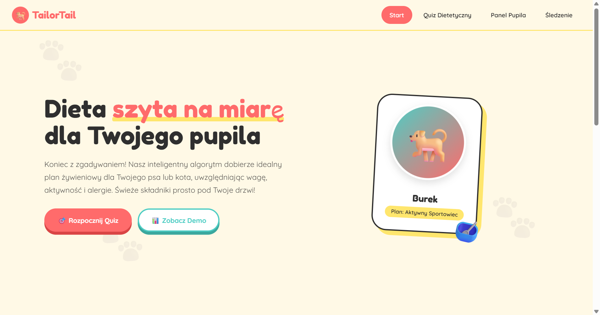
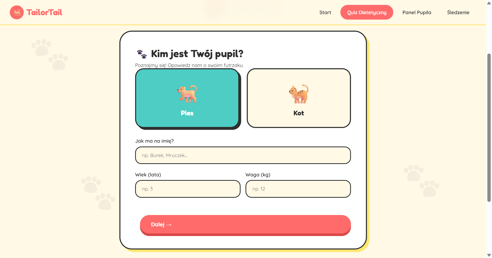
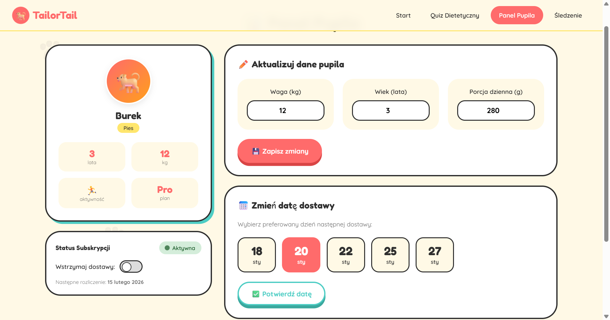
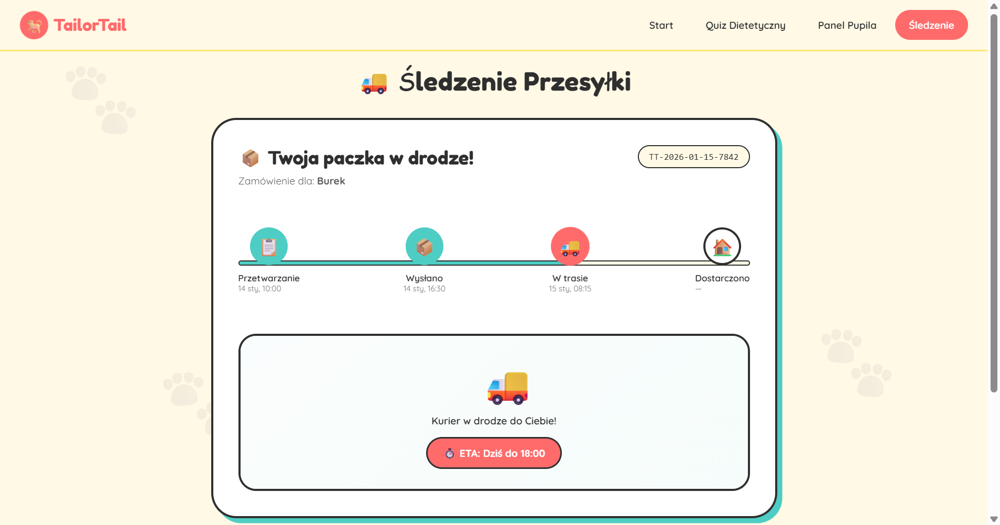

# TailorTail — Custom Nutrition for Your Pet

Static demo site (HTML/CSS/JS) showcasing a subscription product that delivers personalized meal plans for dogs and cats. Ready for light customization and static hosting. Created by an Agent AI.

## Overview

Single-page interface with a multi-step quiz, pet dashboard, delivery tracking and simple subscription logic — all client-side (no backend).

## Features

- Responsive layout (desktop → mobile)
- Sections: Hero, features grid, diet quiz, pet dashboard, tracking, footer
- Multi-step quiz:
  - Species, name, age, weight
  - Activity level
  - Allergies / exclusions
  - Diet recommendation (kcal, protein, delivery interval, price)
- Dashboard: preview and edit pet stats, delivery date chooser, pause/resume subscription
- Tracking timeline and ETA placeholder
- Animations and lightweight interactions — no external dependencies

## Live demo

https://krifiz.github.io/tailor-tail/

## Screenshots

## Screenshots

  

## Edit & Customize

- Main file: `index.html` (contains markup, styles and inline <script>).
- Update text, icons and numbers directly in `index.html`.
- Quiz and diet calculation logic live in the inline `<script>` — adapt the algorithm or connect a backend as needed.
- Demo initial profile is set in `document.addEventListener('DOMContentLoaded', ...)`.

## License

MIT — use and modify as needed.
